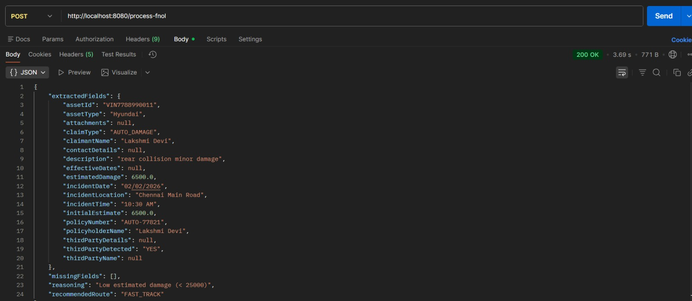
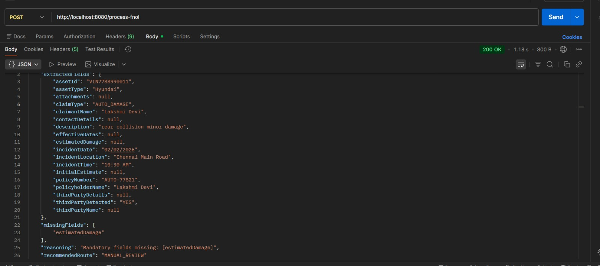
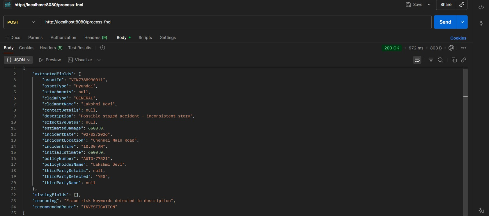

#  Autonomous FNOL Claim Processing Agent

A lightweight backend agent that processes **First Notice of Loss (FNOL)** documents and performs:

- PDF text extraction
- Field extraction
- Validation of mandatory fields
- Claim classification
- Rule-based workflow routing
- Reasoning explanation output

---

#  Problem Breakdown

The FNOL processing pipeline is divided into deterministic stages:

PDF → Text → Structured Fields → Validation → Classification → Routing → Reasoning


---

#  Tech Stack

- Java 17
- Spring Boot
- Apache PDFBox
- Regex-based extraction
- REST API
- Postman testing

---

#  Architecture Modules

## Parser Layer
Extracts structured fields from FNOL PDFs using layout-aware pattern extraction.

## Validation Layer
Checks mandatory fields and detects missing or inconsistent values.

## Classification Layer
Derives claim type using description keywords.

## Routing Engine

Routes claims using priority rules:

missing fields → MANUAL_REVIEW
fraud keywords → INVESTIGATION
injury claims → SPECIALIST_QUEUE
low damage (< 25K) → FAST_TRACK
else → STANDARD_QUEUE


---

#  Approach & Logic Design

## Step 1 — Document Ingestion

FNOL documents are uploaded through a REST endpoint.  
Apache PDFBox is used to extract the text layer from the PDF.

**Design choice**
- Use reliable text extraction

---

## Step 2 — Field Extraction Strategy

Instead of naive regex matching, a label-anchored extraction approach was used:

- Patterns are anchored to FNOL form headings
- Capture groups restricted to same-line values
- Post-filters remove form instruction text (like *INSURED’S MAILING ADDRESS*)
- Person-name cleaner removes business keywords from name fields

**Protections implemented**

- Prevent heading bleed into values
- Reject all-caps label lines
- Trim trailing field instructions
- Stop capture at known label keywords

This made extraction robust across FNOL layout variations.

---

## Step 3 — Structured Claim Model

All extracted data is mapped into a structured `ClaimData` model:

- Policy information
- Incident information
- Parties involved
- Asset details
- Financial estimate
- Derived claim type

This allows validation and routing to operate on structured data instead of raw text.

---

## Step 4 — Validation Layer

A dedicated validation service checks:

- missing mandatory fields
- format inconsistencies (example: invalid date)
- incomplete asset or estimate data

Validation runs **before routing** and can override routing decisions.

---

## Step 5 — Priority-Based Routing Engine

Routing is rule-driven with strict priority order to avoid conflicts:

missing fields → MANUAL_REVIEW
fraud keywords → INVESTIGATION
injury claims → SPECIALIST_QUEUE
low damage (< 25K) → FAST_TRACK
else → STANDARD_QUEUE


---

## Step 6 — Reasoning Output

Every routing decision produces a short reasoning message, for example:

- “Mandatory fields missing”
- “Fraud indicators detected in description”
- “Claim classified as injury-related”
- “Low estimated damage — fast track eligible”

This makes the agent’s behavior auditable and transparent.

---

## Step 7 — Test Matrix Driven Development

The system was verified using multiple FNOL scenarios:

- Fast-track case
- Missing-field case
- Injury case
- Fraud case
- High-damage standard case

Each scenario was tested through Postman with JSON output verification.

---

#  How To Run

## Prerequisites

- Java 17+
- Maven installed
- Git installed
- Postman (or similar API tool)

---

## Clone Repository

```bash
git clone https://github.com/Lakshmidevi1238/fnolclaimagent.git
cd fnolclaimagent

```
---
# Start Application

```bash
mvn spring-boot:run
```
---
# Server starts at:

```bash
http://localhost:8080
```
---

#Test Endpoint

POST /process-fnol

 Body → form-data
 key = file
 value = upload FNOL PDF

---

# Sample Routing Outputs

## Fast Track 



---

## Missing Fields



---

## Fraud Signal 



---


